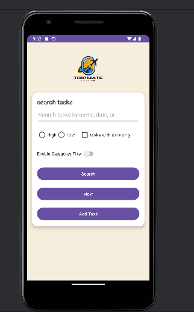
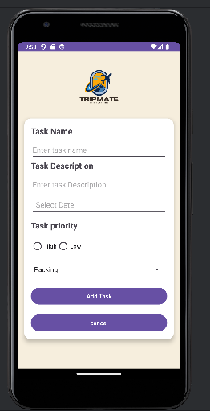
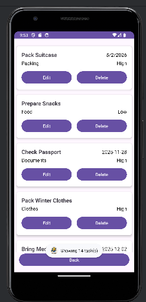

<p align="center">
  
</p>

<h1 align="center">📱 TripMate – Smart Trip Task Manager</h1>

<p align="center">
  A simple and powerful Android application for organizing and managing trip tasks with ease.
</p>

<p align="center">
  <!-- Badges -->
  
  
  
  
</p>

---

## 📘 Overview

TripMate is a lightweight Android app designed to help users **plan, organize, and track trip-related tasks**.  
It uses **SharedPreferences + Gson** to store tasks locally and shows them in a clean **RecyclerView** interface.

---

## 🚀 Features

### ✔ Task Management  
- Add new tasks  
- Edit tasks  
- Delete tasks  
- View all tasks in a RecyclerView

### ✔ Detailed Task Fields  
- Task name  
- Description  
- Category (via Spinner)  
- Priority (High / Low)  
- Date selection (DatePicker & optional EditText popup)

### ✔ Data Storage  
- Tasks stored locally using **SharedPreferences**  
- Saved as JSON using **Gson**  
- Automatically loads tasks on startup

### ✔ User Experience  
- Add/Edit use the same screen  
- Buttons change between *Add* and *Update* mode  
- Validation for empty fields  
- Clean UI with CardView layout

---

## 🧰 Tech Stack

| Component | Purpose |
|----------|---------|
| **Java** | Main development language |
| **Android Studio** | IDE |
| **RecyclerView** | Displaying tasks |
| **CardView** | Task UI blocks |
| **SharedPreferences** | Local storage |
| **Gson** | JSON serialization |
| **DatePicker** | Date selection |
| **ConstraintLayout + LinearLayout** | UI design |

---

## 📁 Project Structure

```

TripMate/
│
├── java/com.example.tripplanningapp/
│   ├── MainActivity.java
│   ├── TaskEditActivity.java
│   ├── ViewTasksActivity.java
│   ├── Task.java
│   ├── TaskAdapter.java
│   └── SharedPrefHelper.java
│
├── res/
│   ├── layout/
│   │   ├── activity_main.xml
│   │   ├── activity_edit_task.xml
│   │   ├── activity_view_tasks.xml
│   │   └── item_task.xml
│   ├── values/
│       ├── strings.xml
│       └── colors.xml
│
└── AndroidManifest.xml

````

---

## 📸 Screenshots


| Screen | Preview |
|--------|---------|
| Home Screen |  |
| Add Task |  |
| Task List |  |

---

## ⚙️ Installation

### 1️⃣ Clone the Repository  
```bash
git clone https://github.com/abdallahabed/TripMate.git

````

### 2️⃣ Open in Android Studio

File → Open → Select project folder

### 3️⃣ Build & Run

* Connect device or open emulator
* Click **▶ Run**

---

## 🧠 How It Works

* All tasks stored using **SharedPreferences (as JSON)**
* Gson converts Task objects into JSON automatically
* RecyclerView updates dynamically whenever tasks change
* A unified Add/Edit screen simplifies interaction
* Each task gets a unique ID using `System.currentTimeMillis()`

---

## 🌟 Future Improvements
* 🔔 Add notifications/reminders
* ☁ Cloud sync
* ☾ Dark mode
* Multi-trip support

---

## 👨‍💻 Developer

**Abdallah Aabed**
Computer Science Student – Birzeit University
Data Analysis Nanodegree Graduate
Android • Java • C# • Unity • Web • Data Visualization

---

## 📜 License

This project is licensed under the **MIT License**.
Free to modify, use, and distribute.

---


